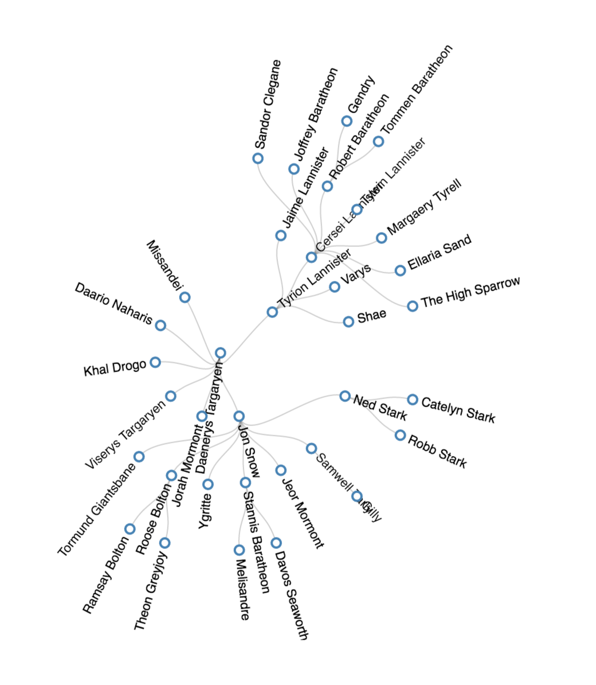
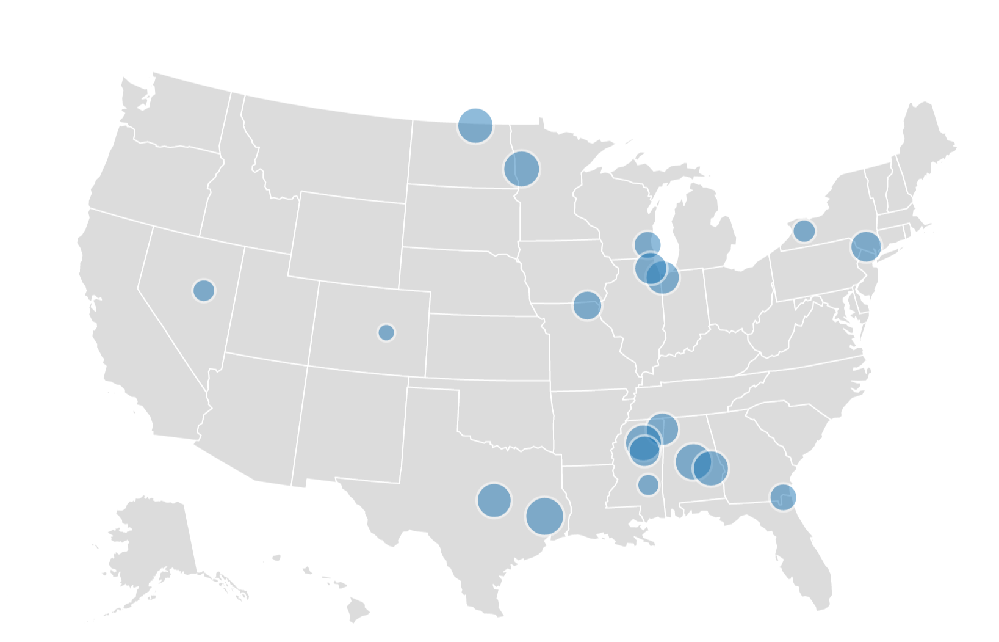
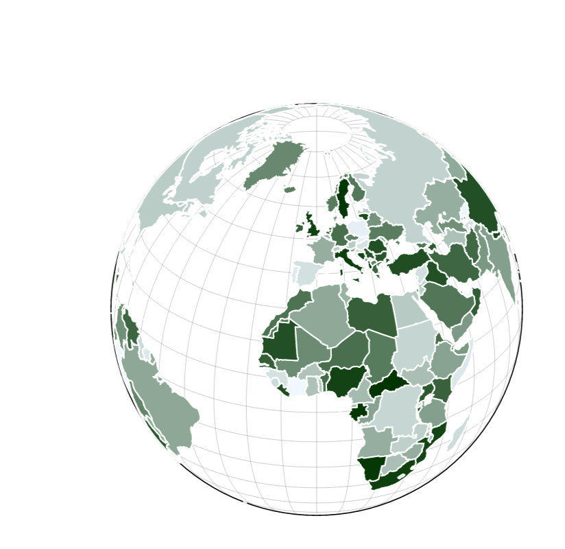

# jarvis (just another visualization tool)
Built on top of d3, jarvis is a visualization library that can be rendered in a browser or Jupyter Notebook. Hence, people who don't know javascript or d3 can make some nice, interactive charts in mininal Python code.

Examples here: https://lichangny.github.io/jarvis/. You can also download the [test.ipynb](https://github.com/LiChangNY/jarvis/blob/master/jarvis/test.ipynb) to see how to render charts in Jupyter Notebook.

## Chart Types
If you want to visualize basic graphes (e.g., line charts, bar charts, and pie charts, etc.), there're many open-source libraries - To name a few, nvd3, plotly, and altair - that would fulfill your purpose and certainly each has its own pros and cons. The current plan for jarvis is to focus on more complex charts that are not used very commonly. For example:

### Force-directed graph

### Sankey chart

### Radial chart

### Geo-map

### A map with orthographic projection

